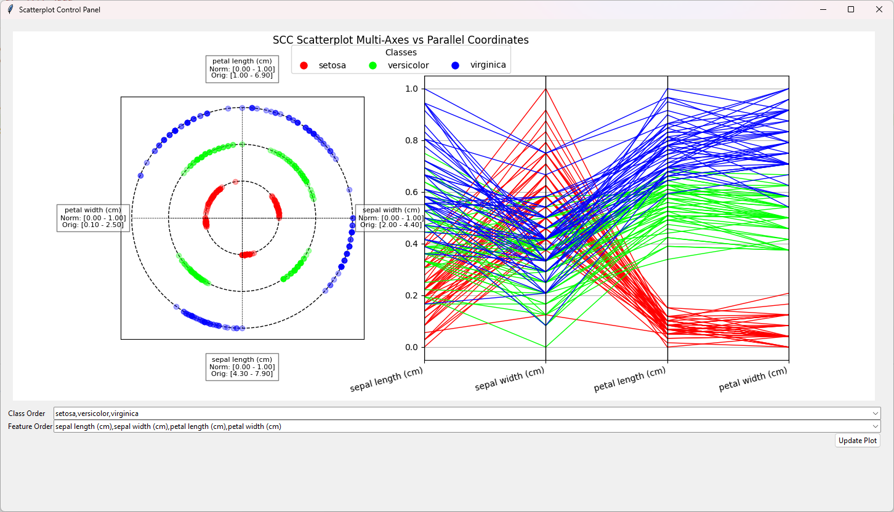

# SimplifiedSCC

Simplified SCC to PC comparison tool.

SCC: Static Circular Coordinates
PC: Parallel Coordinates, sometimes referred to as PCP for Parallel coordinates plot.

## Screenshots

Demo screenshot 1:

