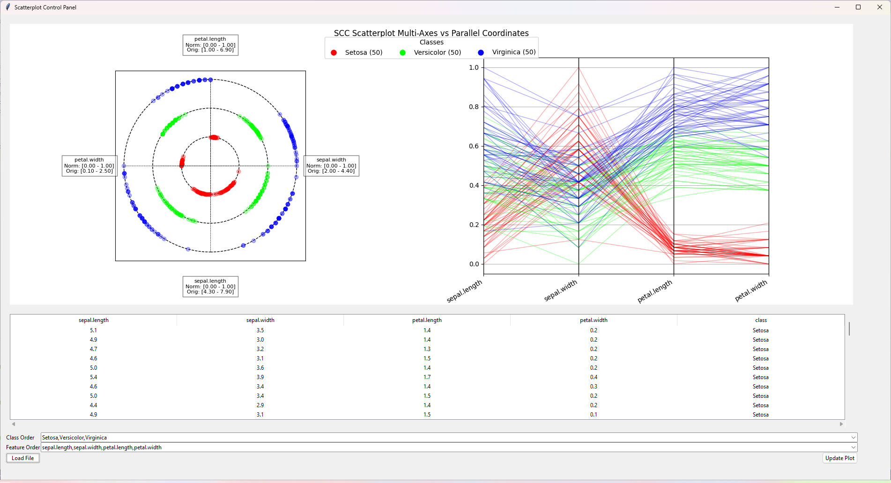

# SimplifiedSCC

Simplified Static Circular Cooridnates (SCC) to Parallel Coordinates (PC) comparison tool.

## Data

Data that can be loaded to visualize must be in the `.csv` or `.txt` file format. The data should be numerical tabular data. With only one column having the name of `class` which should contain the data labels. Example:

```csv
X, Y, Z, W, class,
0, 0, 0, 0, horiz,
5, 5, 5, 5, horiz,
1, 2, 3, 4, verti,
4, 2, 3, 1, verti,
```

## Screenshots

Demo screenshot of Fisher Iris dataset:


## License

This project is freely available for both private and commercial use under the MIT license, please see `LICENSE` for full deatails.
