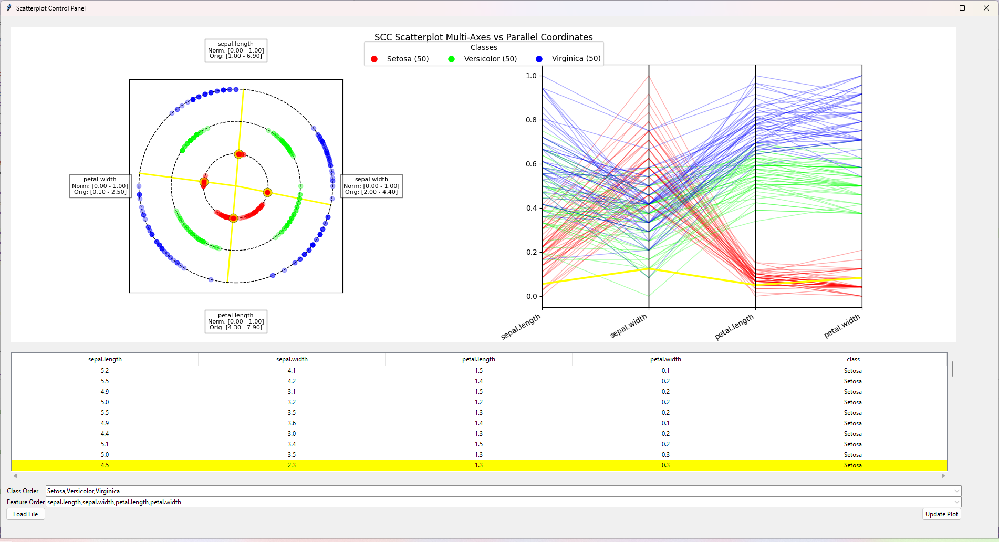

# SimplifiedSCC

Simplified Static Circular Cooridnates (SCC) and Parallel Coordinates (PC) comparison tool providing a coordinated linked view of SCC, PC, and tabular views. A point highlighted in SCC or tabular views are shown highlighted in all three views. This is a demonstration of multidimensional general line coordinate construction of SCC and PC for building visual machine learning models from data.

## Data

Data that can be loaded to visualize must be in the `.csv` or `.txt` file format. The data should be numerical tabular data. With only one column having the name of `class` which should contain the data labels. Example:

```csv
X, Y, Z, W, class,
0, 0, 0, 0, horiz,
5, 5, 5, 5, horiz,
1, 2, 3, 4, verti,
4, 2, 3, 1, verti,
```

If the class name is `benign` or `malignant` case-insensitive then the class color assigned is green and red respectively. Otherwise, we linearly divide the HSV color model for a visually distinct default color palette.

## Demonstrative Screenshots

Fisher Iris dataset default visualization:


Tracing a outier in Setosa class sepal.width attribute of Fisher Iris dataset.


## License

This project is freely available for private and commercial use under the MIT license, please see `LICENSE` for full deatails.
